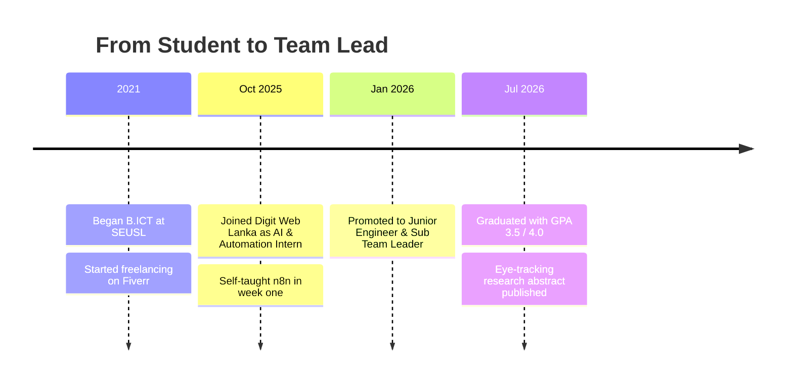

  

   

  
  
  
  

 

## 👋 About Me

I'm **Antony Dilaikshan Mevin Jeyakumar** — a results-driven **AI & Automation Engineer** and **Sub Team Leader** at **Digit Web Lanka** (120+ employees, UK e-commerce operations). I design, rescue, and ship production-grade **automation systems, LLM-integrated workflows, and full-stack business intelligence platforms**.

I was promoted to Junior Engineer and Sub Team Leader within **3 months**, self-taught **n8n in week one**, and delivered profit-generating systems before my first month ended. I'm also a **published AI researcher** (Grade A) and the **founder of Tech Wings Society** at South Eastern University of Sri Lanka (SEUSL).

> 🎓 **B.ICT (Hons) in Software Technologies** — SEUSL · GPA **3.5 / 4.0**

## 📈 Impact at a Glance

## 💼 What I'm Doing Now

- 🧠 **Leading a team of 3 engineers** — daily standups, task assignment, mentoring, and reporting to the Department Head and Managing Director
- 🏛️ **Automation governance** — built the company's first **n8n Governance Registry integrated with Claude MCP** (execution logging, ROI visibility, duplicate-task prevention)
- 🔗 **API Registry** — documented 30+ APIs, now the onboarding standard for 8+ engineers
- 📊 **KPI Dashboard & Pulse Dashboard** — React / Next.js / Node.js / MySQL platforms used daily across the company
- 🔬 **Research** — exploring ML, AI, and IoT with a focus on accessibility

## 🛠️ Tech Stack

## 🚀 Career Journey

## 🏆 Featured Work

<b>⚙️ Automation & AI Systems (Digit Web Lanka)</b>

 

| Project | Stack | Impact |
|---|---|---|
| **n8n Governance Registry + Claude MCP** | n8n, Claude MCP | Tracks 150+ workflows with logging, ROI visibility, duplicate prevention |
| **KPI Dashboard** *(rescued & rebuilt solo in 3 weeks)* | React, Node.js, TypeScript, Express.js, MySQL | 30–40 daily users, 15,000+ ASINs, ~2 hrs/day of reporting saved |
| **Weekly ASIN Performance Monitoring** | n8n, MySQL, Google Sheets | 400 min → 6 min per cycle (98.5% faster) |
| **Product Segmentation System** | n8n, Google Sheets | 7,000+ ASINs categorized biweekly, ~44 person-hours saved per run |
| **AI Product Title Generation** | n8n, Gemini | ~22 person-hours saved per run; improved impressions & CTR |
| **Competitor Image Intelligence** | Python, Selenium, Qwen 2.5 VL, Ollama, n8n | 800+ competitor checks per run, 5 products in parallel |
| **Amazon Review Automation** | Python, n8n, Shopify | 4,000+ ASINs managed, 3,500+ verified reviews published |
| **Keyword Indexing Automation** | Python, Playwright, Helium 10 API | 1,000 keywords per ASIN, replacing a fully manual process |
| **Sales Forecasting Framework** | n8n, Google Sheets, Apps Script | Seasonal quarterly forecasts across 1,000 SKUs |
| **PMax Placement Exclusion Detection** | n8n, Slack | ~1 hour saved per user per run |
| **Listing Image Generation** | n8n, Gemini | Multiple image variations from just an ASIN and image URL |
| **API Registry** | Documentation & governance | 30+ APIs, adopted by 8+ engineers |
| **Pulse Dashboard** | React, Next.js, TypeScript, MySQL | Check-in/out, commitment tracking, performance monitoring |

<b>🔬 Research</b>

 

### 👁️ Assistive Eye-Tracking System for Partially Blind Users Using Mobile Devices
*South Eastern University of Sri Lanka · 2025–2026 · **Grade A** · Abstract published*

A multi-input **CNN** enabling **low-cost, software-only mobile eye-tracking** for users with myopia and cataract — an alternative to expensive hardware-dependent solutions in developing countries.

- 🎯 **MAE:** 0.0082 &nbsp;|&nbsp; 🏠 **70%** indoor accuracy &nbsp;|&nbsp; 🌍 **62%** real-world accuracy
- 🧪 Data augmentation and model optimization to overcome limited dataset constraints
- 🧰 `Python` `OpenCV` `MediaPipe` `CNN` `Deep Learning` `Computer Vision`

<b>📱 Academic, Client & Personal Projects</b>

 

| Project | Description | Tech |
|---|---|---|
| ⚡ **OasisAmps** | EV charger locating, booking, and listing platform with maps and payments | `Laravel` `Bootstrap 5` `MySQL` `Google Maps API` `Stripe` |
| 🏗️ **Ilfa Engineering Inventory System** *(paid client, deployed)* | Role-based inventory & construction project management with financial reports | `Laravel 12` `PHP 8.2` `MySQL` `Chart.js` `Hostinger` |
| 🎒 **Foundli** | Campus lost & found app with live chat and AI image moderation | `Flutter` `Firebase` `Azure Functions` `Sightengine` |
| 🎓 **GPA Calculator App** | GPA calculation, academic prediction, and course tracking | `Flutter` `Dart` `Firebase Auth` `Firestore` |
| 🖱️ **Eye Control Mouse** | Hands-free mouse control via real-time eye tracking | `Python` `OpenCV` `MediaPipe` `PyAutoGUI` |

## 🌱 Leadership & Community

- 🏛️ **Founder & President, Tech Wings Society** — built a technology society for Tamil-speaking students in the Faculty of Technology from zero, ran workshops and events, and handed it to junior members who formally registered it
- 🎤 **AI Workshop Facilitator** — designed and delivered a school-level AI workshop with live demos at Vavuniya Tamil Madhiya Maha Vidyalayam
- 📢 **AI Awareness Presenter** — presented at SEUSL's 27th Anniversary Open Day

## 📜 Certifications

## 📊 GitHub Activity

  
    
  <picture>
    <source media="(prefers-color-scheme: dark)" srcset="https://raw.githubusercontent.com/Dilaikshan/Dilaikshan/output/github-contribution-grid-snake-dark.svg" />
    <source media="(prefers-color-scheme: light)" srcset="https://raw.githubusercontent.com/Dilaikshan/Dilaikshan/output/github-contribution-grid-snake.svg" />
    
  </picture>

## 🌐 Languages

🇱🇰 **Tamil** — Fluent &nbsp;·&nbsp; 🇬🇧 **English** — Fluent &nbsp;·&nbsp; 🇱🇰 **Sinhala** — Intermediate

## 📬 Let's Connect

💬 *Open to collaborations, freelance work, and conversations about AI, automation, and software.*

